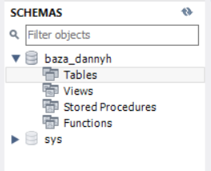
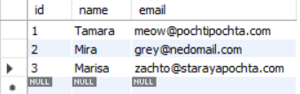
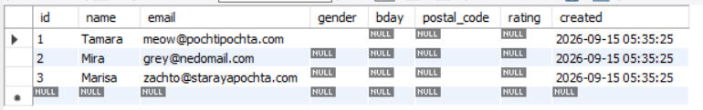
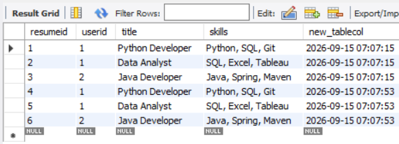
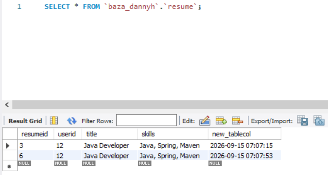

# Лабораторная работа 1. Начало работы с MySQL. MySQL Workbench

**Выполнила:** студентка 2об_ПОО, Иванова Елизавета  
**Клиент:** MySQL Workbench  
**Подключение:** `127.0.0.1:33060`, пользователь `root`

---

## Задание 1. Назначение разделов Management, Instance, Performance

### Раздел «Management» (Управление)

1. **Server Status.** Отображает общую информацию о сервере и подключении к нему:
   - общая информация (имя хоста, номер порта, версия БД, версия ОС);
   - настройки сервера (SSL, брандмауэр);
   - каталоги сервера (данные, логи, конфигурация);
   - сводка по ресурсам компьютера (ОЗУ, ЦП, диск);
   - параметры SSL-соединения.

2. **Client Connections.** Список активных подключений к серверу в реальном времени: кто подключён, с какого хоста, какие запросы выполняет. Позволяет принудительно завершить подключение.

3. **Users and Privileges.** Управление пользователями MySQL и их правами: создание/удаление, назначение привилегий, смена пароля, настройка плагина аутентификации.

4. **Status and System Variables.** Просмотр и изменение системных переменных сервера, а также текущих статусов (uptime, число запросов, использованная память).

5. **Data Export / Data Import.** Экспорт баз данных и таблиц в SQL-файлы; импорт данных из CSV, JSON, SQL.

6. **Instance.** Управление экземпляром сервера: запуск/остановка, конфигурация, просмотр логов, редактирование конфигурационного файла.

### Раздел «Instance» (Экземпляр БД)

1. **Startup / Shutdown.** Запуск и остановка MySQL-сервера, настройка параметров запуска.
2. **Server Logs.** Просмотр логов сервера: error log, general query log, slow query log.
3. **Options File.** Просмотр и редактирование конфигурационного файла MySQL (`my.ini` / `my.cnf`) прямо из Workbench.

### Раздел «Performance» (Производительность)

1. **Dashboard.** Графики нагрузки на сервер в реальном времени: количество запросов, использование памяти, процессора, число соединений.
2. **Performance Reports.** Отчёты по производительности: самые долгие запросы, самые частые запросы, использование индексов, статистика по таблицам.
3. **Performance Schema Setup.** Настройка сборщика метрик Performance Schema.

---

## Задание 2. Создание базы данных

Была создана база данных:
:

```sql
CREATE TABLE `new_table` (
  `id` int NOT NULL AUTO_INCREMENT,
  `name` varchar(45) NOT NULL,
  `email` varchar(45) NOT NULL,
  PRIMARY KEY (`id`),
  UNIQUE KEY `email_UNIQUE` (`email`)
) ENGINE=InnoDB DEFAULT CHARSET=utf8mb4 COLLATE=utf8mb4_0900_ai_ci;
```

**Параметры полей:**

| Поле | Тип | Ограничения |
|---|---|---|
| `id` | INT | PK, NOT NULL, AUTO_INCREMENT |
| `name` | VARCHAR(45) | NOT NULL |
| `email` | VARCHAR(45) | NOT NULL, UNIQUE |





### Добавление записей

В режиме Result Grid были построчно введены записи:

| id | name | email |
|---|---|---|
| 1 | Tamara | meow@pochtipochta.com |
| 2 | Mira | grey@nedomail.com |
| 3 | Marisa | zachto@starayapochta.com |

После нажатия кнопки **Apply** Workbench сгенерировал следующие SQL-запросы:

```sql
INSERT INTO `baza_dannyh`.`new_table` (`name`, `email`) VALUES ('Tamara', 'meow@pochtipochta.com');
INSERT INTO `baza_dannyh`.`new_table` (`name`, `email`) VALUES ('Mira', 'grey@nedomail.com');
INSERT INTO `baza_dannyh`.`new_table` (`name`, `email`) VALUES ('Marisa', 'zachto@starayapochta.com');
```



## Дополнение таблицы новыми полями

Через Table Editor в таблицу были добавлены пять новых полей. SQL-запрос, сгенерированный Workbench:

```sql
ALTER TABLE `baza_dannyh`.`new_table`
  ADD COLUMN `gender` ENUM('M', 'F') NULL AFTER `email`,
  ADD COLUMN `bday` DATE NULL AFTER `gender`,
  ADD COLUMN `postal_code` VARCHAR(10) NULL AFTER `bday`,
  ADD COLUMN `rating` FLOAT NULL AFTER `postal_code`,
  ADD COLUMN `created` TIMESTAMP NULL DEFAULT 'CURRENT_TIMESTAMP()' AFTER `rating`;
```

**Итоговая структура таблицы:**

| Поле | Тип | Ограничения | Комментарий |
|---|---|---|---|
| `id` | INT | PK, NN, AI | Первичный ключ |
| `name` | VARCHAR(50) | NN | Имя |
| `email` | VARCHAR(45) | NN, UQ | Уникальный email |
| `gender` | ENUM('M','F') | NULL | Пол |
| `bday` | DATE | NULL | Дата рождения |
| `postal_code` | VARCHAR(10) | NULL | Почтовый индекс |
| `rating` | FLOAT | NULL | Рейтинг |
| `created` | TIMESTAMP | NULL, DEFAULT | Дата и время создания |

### Замечание 2. Что означает `TIMESTAMP DEFAULT CURRENT_TIMESTAMP()`

**`TIMESTAMP`** — тип данных MySQL, хранящий одновременно дату и время. В отличие от `DATETIME`, `TIMESTAMP` хранит значение в UTC и автоматически конвертирует его в часовой пояс сервера при выводе.

**`CURRENT_TIMESTAMP()`** — встроенная функция MySQL, возвращающая текущие дату и время на момент вызова.

**`DEFAULT CURRENT_TIMESTAMP()`** означает: если при вставке новой записи не указать значение для этого поля, MySQL автоматически подставит текущее время. Пользователю не нужно вводить дату создания вручную.

Экспериментально подтверждено: все записи в таблице получили значение `created` автоматически без явного указания при `INSERT`.


### Замечание 3. Поля, которые могут быть NULL

Пользователь не всегда хочет делиться персонализированной информацией, поэтому логично, что часть полей может оставаться пустой (`NULL`):

- **`gender`** — пол;
- **`bday`** — дата рождения;
- **`postal_code`** — почтовый индекс;
- **`rating`** — рейтинг;
- **`created`** — дата создания (заполняется автоматически или может быть NULL при переносе старых данных).

**Обязательными (NN)** оставлены только `name` и `email` — минимально необходимая информация для идентификации пользователя.



## Экспорт набора записей в SQL-файл

Через кнопку **Export recordset to external file** (панель над Result Grid) был сохранён файл с SQL-запросами, соответствующими текущему содержимому таблицы.

Содержимое экспортированного файла:

```sql
/*
-- Query: SELECT * FROM `baza_dannyh`.`users`
LIMIT 0, 1000

-- Date: 2026-09-15 09:28
*/
INSERT INTO `` (`id`,`name`,`email`,`gender`,`bday`,`postal_code`,`rating`,`created`) VALUES (1,'Tamara','meow@pochtipochta.com','F','2000-01-07','123456',1,'2026-09-15 05:35:25');
INSERT INTO `` (`id`,`name`,`email`,`gender`,`bday`,`postal_code`,`rating`,`created`) VALUES (2,'Mira','grey@nedomail.com','F','1998-09-20','654321',2.1,'2026-09-15 05:35:25');
INSERT INTO `` (`id`,`name`,`email`,`gender`,`bday`,`postal_code`,`rating`,`created`) VALUES (3,'Marisa','zachto@starayapochta.com','F','1996-06-16','246135',3.2,'2026-09-15 05:35:25');
```

### Анализ синтаксиса

Экспортированный файл содержит:

1. **Комментарий с исходным запросом.** В верхней части файла — закомментированный (через `/* ... */`) запрос `SELECT`, который использовался для получения данных, и дата экспорта. Это удобно для понимания, откуда взялись данные.

2. **Три запроса `INSERT`** — по одному на каждую строку таблицы. Синтаксис:
   ```sql
   INSERT INTO <таблица> (<столбцы>) VALUES (<значения>);
   ```

   В отличие от ручного добавления (Задание 4), где указывались только `name` и `email`, здесь перечислены **все столбцы**, включая `id` и `created`. Это позволяет точно воспроизвести данные — например, при переносе таблицы в другую базу.

3. **Значения подставляются в том же порядке**, что и столбцы:
   - числа (`id`, `rating`) — без кавычек;
   - строки и даты (`name`, `email`, `gender`, `bday`, `postal_code`, `created`) — в одинарных кавычках.



## Создание таблицы `resume` с внешним ключом

Таблица создана через Table Editor. SQL-запрос (получен через **Copy to Clipboard → Create Statement**):

```sql
CREATE TABLE `resume` (
  `resumeid` int NOT NULL AUTO_INCREMENT,
  `userid` int NOT NULL,
  `title` varchar(100) NOT NULL,
  `skills` text,
  `new_tablecol` timestamp NULL DEFAULT CURRENT_TIMESTAMP,
  PRIMARY KEY (`resumeid`),
  KEY `fk_resume_user_idx` (`userid`),
  CONSTRAINT `fk_resume_user`
    FOREIGN KEY (`userid`)
    REFERENCES `users` (`id`)
    ON DELETE CASCADE
    ON UPDATE CASCADE
) ENGINE=InnoDB DEFAULT CHARSET=utf8mb3;
```

### Как будет вести себя СУБД при удалении связанных записей

Поведение определяется параметром **`ON DELETE CASCADE`** во внешнем ключе `fk_resume_user`.

**При удалении пользователя из таблицы `users`:**

- СУБД автоматически найдёт все записи в `resume`, у которых `userid` совпадает с `id` удаляемого пользователя.
- Все эти записи будут **автоматически удалены** — без дополнительных команд.
- В `resume` не останется «висячих» записей — ссылочная целостность сохраняется.

**Пример:**

```sql
DELETE FROM `baza_dannyh`.`users` WHERE `id` = 1;
```

Все резюме пользователя с `id = 1` удалятся автоматически, даже если явно не вызывать `DELETE FROM resume`.

**При изменении `id` пользователя (благодаря `ON UPDATE CASCADE`):**

- Значение `userid` во всех его резюме автоматически обновится на новое.
- Связь между таблицами не потеряется.

Таким образом, `ON DELETE CASCADE` упрощает работу с базой: при удалении пользователя не нужно вручную чистить связанные таблицы.


## Наполнение таблицы `resume`

В таблицу `resume` были добавлены записи, связанные с существующими пользователями:

```sql
INSERT INTO `baza_dannyh`.`resume` (`userid`, `title`, `skills`) VALUES
(1, 'Python Developer', 'Python, SQL, Git'),
(1, 'Data Analyst', 'SQL, Excel, Tableau'),
(2, 'Java Developer', 'Java, Spring, Maven'),
(1, 'Python Developer', 'Python, SQL, Git'),
(1, 'Data Analyst', 'SQL, Excel, Tableau'),
(2, 'Java Developer', 'Java, Spring, Maven');
```

### Экспорт набора записей через «Export recordset to external file»

Через кнопку **Export recordset to external file** (панель над Result Grid) был сохранён SQL-файл с текущим содержимым таблицы `resume`:

```sql
/*
-- Query: SELECT * FROM `baza_dannyh`.`resume`
LIMIT 0, 1000

-- Date: 2026-09-15 09:35
*/
INSERT INTO `` (`resumeid`,`userid`,`title`,`skills`,`new_tablecol`) VALUES (1,1,'Python Developer','Python, SQL, Git','2026-09-15 07:07:15');
INSERT INTO `` (`resumeid`,`userid`,`title`,`skills`,`new_tablecol`) VALUES (2,1,'Data Analyst','SQL, Excel, Tableau','2026-09-15 07:07:15');
INSERT INTO `` (`resumeid`,`userid`,`title`,`skills`,`new_tablecol`) VALUES (3,2,'Java Developer','Java, Spring, Maven','2026-09-15 07:07:15');
INSERT INTO `` (`resumeid`,`userid`,`title`,`skills`,`new_tablecol`) VALUES (4,1,'Python Developer','Python, SQL, Git','2026-09-15 07:07:53');
INSERT INTO `` (`resumeid`,`userid`,`title`,`skills`,`new_tablecol`) VALUES (5,1,'Data Analyst','SQL, Excel, Tableau','2026-09-15 07:07:53');
INSERT INTO `` (`resumeid`,`userid`,`title`,`skills`,`new_tablecol`) VALUES (6,2,'Java Developer','Java, Spring, Maven','2026-09-15 07:07:53');
```

### Анализ синтаксиса экспортированных запросов

- Каждая запись таблицы представлена отдельным `INSERT`-запросом.
- Перечислены **все столбцы**: `resumeid`, `userid`, `title`, `skills`, `new_tablecol`.
- Значения подставляются **в том же порядке**, что и столбцы.
- Строковые и временные значения — в одинарных кавычках, числовые (`resumeid`, `userid`) — без кавычек.
- В начале файла — закомментированный `SELECT` с датой экспорта.
- Имя таблицы в экспорте — ` `` ` (пустые обратные кавычки), Workbench не подставил его автоматически. Для выполнения файла имя надо вписать вручную: `baza_dannyh`.`resume`.

### Попытка добавить резюме с несуществующим `userid`

```sql
INSERT INTO `baza_dannyh`.`resume` (`userid`, `title`, `skills`)
VALUES (999, 'Test Resume', 'Test Skills');
```

**Результат:**

```
ERROR 1452 (23000): Cannot add or update a child row:
a foreign key constraint fails (`baza_dannyh`.`resume`,
CONSTRAINT `fk_resume_user` FOREIGN KEY (`userid`)
REFERENCES `users` (`id`) ON DELETE CASCADE ON UPDATE CASCADE)
```

### Ответ на вопрос

**Нет, добавить резюме с несуществующим `userid` невозможно.** Внешний ключ `fk_resume_user` требует, чтобы значение `userid` уже существовало в таблице `users`. Это механизм **ссылочной целостности**: без него в `resume` могли бы появиться «висячие» записи, ссылающиеся на несуществующих пользователей.

**Сколько резюме может быть у одного пользователя?**

- **Минимум — 0.** Пользователь может вообще не иметь резюме (например, в таблице `users` есть пользователи без связанных записей в `resume`).
- **Максимум — не ограничен.** Один пользователь может иметь сколько угодно резюме. В нашем примере у пользователя `userid = 1` — 4 резюме, у `userid = 2` — 2 резюме.


## Удаление пользователя и проверка каскадного удаления

### 1. Удаление пользователя

Был удалён пользователь `id = 1` (Tamara), у которого было несколько резюме в таблице `resume`. SQL-запрос, который Workbench показал после нажатия **Apply**:

```sql
DELETE FROM `baza_dannyh`.`users` WHERE `id` = 1;
```

### 2. Что произошло со связанными сущностями в `resume`

**После выполнения `DELETE FROM users WHERE id = 1`** все 4 резюме с `userid = 1` автоматически удалились. 

**Комментарий.** Такое поведение обеспечивается параметром **`ON DELETE CASCADE`** во внешнем ключе `fk_resume_user` таблицы `resume`:

- При удалении родительской записи (пользователя) из таблицы `users` СУБД автоматически находит все дочерние записи в `resume`, у которых `userid` совпадает с удалённым `id`.
- Все найденные дочерние записи удаляются **без дополнительных команд** со стороны пользователя.
- Если бы стояло `ON DELETE RESTRICT` или `NO ACTION`, MySQL **запретил бы** удаление пользователя с ошибкой `ERROR 1451: Cannot delete or update a parent row: a foreign key constraint fails`, пока на него ссылаются записи в `resume`.

**Практический смысл.** `ON DELETE CASCADE` избавляет от ручной чистки связанных таблиц и сохраняет ссылочную целостность: в `resume` не остаётся «висячих» записей, ссылающихся на несуществующего пользователя.

### 3. Изменение `id` существующего пользователя

Для проверки **`ON UPDATE CASCADE`** был изменён `id` пользователя, у которого есть резюме. Например, пользователю Mira с `id = 2` был присвоен новый `id = 20`:

```sql
UPDATE `baza_dannyh`.`users` SET `id` = 20 WHERE `id` = 2;
```

**Результат:** благодаря `ON UPDATE CASCADE` значение `userid` во всех резюме Mira **автоматически обновилось** с `2` на `20`:

| resumeid | userid (было) | userid (стало) | title |
|---|---|---|---|
| 3 | 2 | 20 | Java Developer |
| 6 | 2 | 20 | Java Developer |

**Комментарий.** Параметр **`ON UPDATE CASCADE`** во внешнем ключе `fk_resume_user` обеспечивает автоматическое обновление дочерних записей при изменении значения родительского ключа:

- При изменении `id` пользователя в таблице `users` MySQL находит все записи в `resume`, у которых `userid` совпадает со старым значением.
- Заменяет `userid` на новое значение `id`.
- Связь между таблицами сохраняется — резюме по-прежнему привязаны к тому же пользователю.


